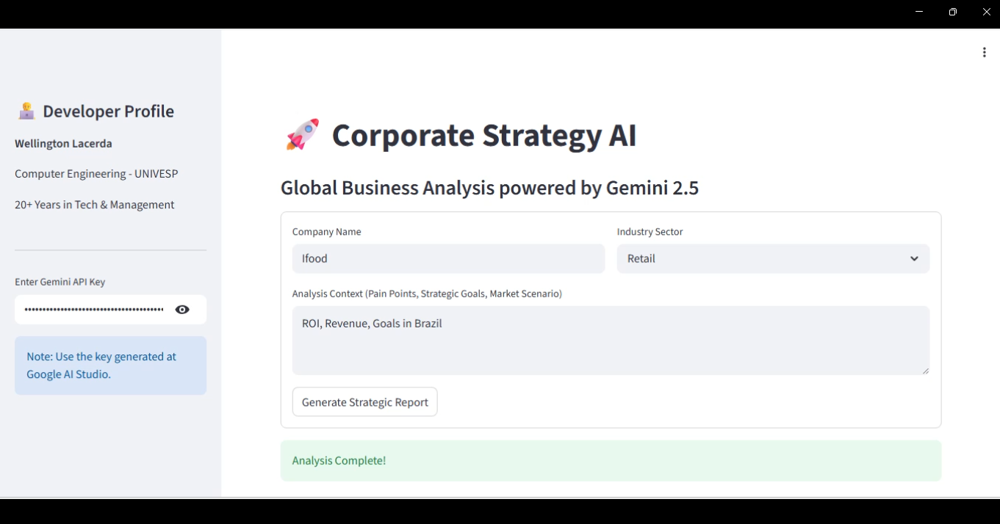
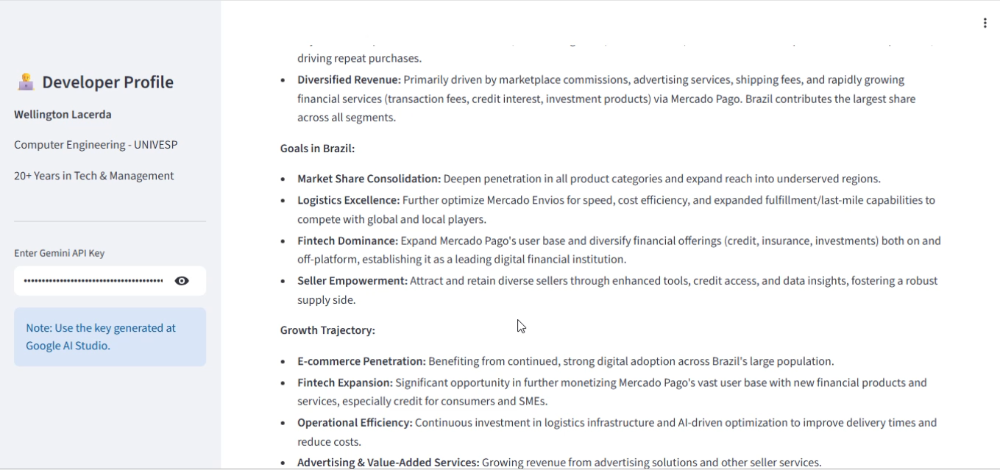
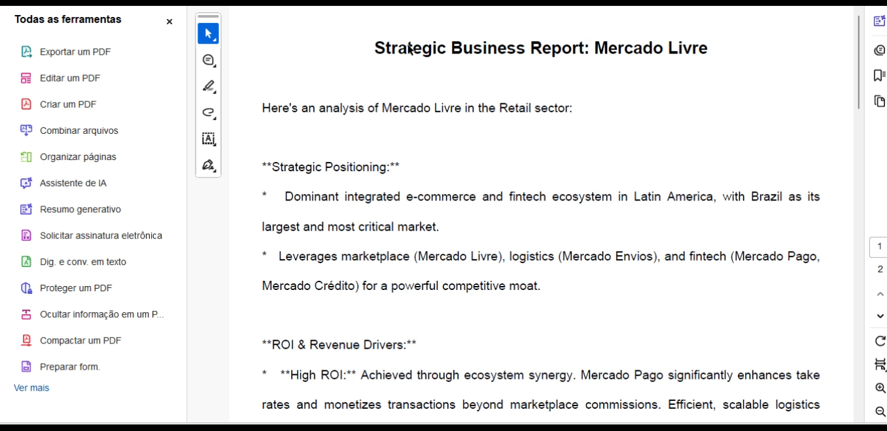

-----

# 📊 Business Analyst AI: Intelligent Strategy & Verification

**Data-Driven Consulting | Google Search Grounding | Oracle Cloud Infrastructure**

## 📌 Project Overview

The **Business Analyst AI** is a sophisticated decision-support tool that transforms raw company data into high-level strategic intelligence. Built to address the need for accuracy in corporate consulting, this application integrates **Gemini 2.5 Flash** with real-time web verification.

By functioning as a "Digital Consultant," it provides verified SWOT analyses, technical innovation roadmaps, and localized market insights for the Brazilian corporate landscape, all hosted on a robust enterprise cloud.

-----

## 🏗️ System Architecture

The solution architecture is designed for professional reliability, ensuring the "Digital Consultant" is always available and secure.

### 🖥️ Cloud Infrastructure (The Foundation)

  * **Hosting:** **Oracle Cloud Infrastructure (OCI)** Virtual Machine (VM).
  * **Deployment:** Powered by **Streamlit**, serving the application via an optimized Python environment.
  * **Cloud Security:** Configured with OCI Security Lists and VCN rules to ensure safe, encrypted access to the consultant interface.

#### **Consultant Interface**

  
   
  <em>Professional Streamlit UI featuring Developer Profile and dynamic Input Forms.</em>

-----

### 🧠 Strategic Intelligence (The Logic)

  * **Verification Gate:** Implements **Google Search Grounding** to cross-reference company names against live global databases.
  * **Zero-Hallucination Policy:** If an organization cannot be verified through real-time search results, the system halts the report generation to maintain data integrity.
  * **Strategic Frameworks:** Automatically applies SWOT and PEST analysis logic tailored to the user's specific industry and pain points.

#### **Market Analysis Output**

  
   
  <em>Automated SWOT Analysis and Technical Innovation Roadmap generated for real-world entities.</em>

-----

## 🚀 Key Features & Deliverables

  * **Grounding & Truth:** Uses live web indexes to ensure all business advice is based on the current reality of the Brazilian market.
  * **Localized Context:** System prompts are optimized for Brazilian logistics (fuel, infrastructure) and management culture.
  * **Instant Documentation:** Features an automated export module that transforms AI insights into professional formats.

#### **Professional Documentation**

  
   
  <em>Terminal execution within the OCI VM environment using Streamlit.</em>

-----

## 👨‍💻 About the Developer

**Wellington Lacerda** *Computer Engineering Student at UNIVESP | Oracle ACE Apprentice* With 20+ years of experience in management and tech ownership, I specialize in building "intelligence engines" on **Oracle Cloud Infrastructure**. My goal is to use Data Science to provide verified, actionable insights for the modern business world.

-----
